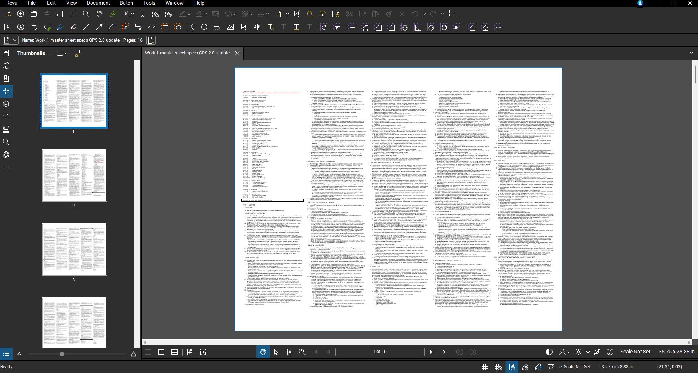
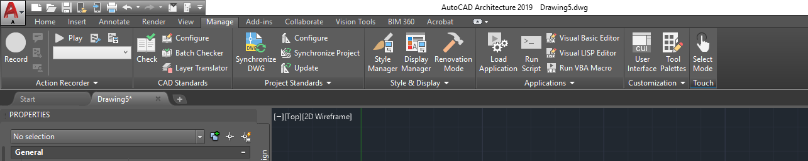
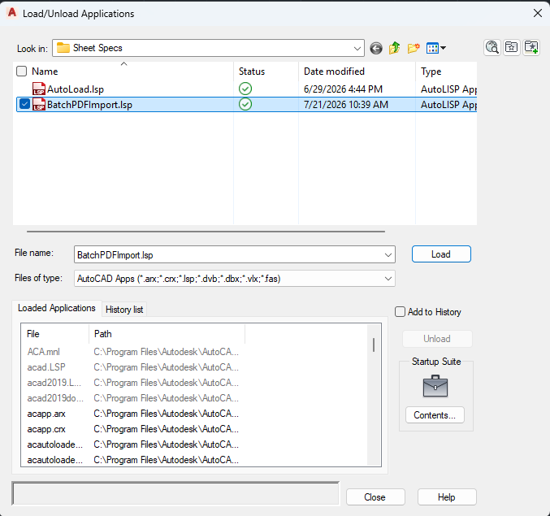

# specsheeter
Add sheet specs to Revit in CAD tex

---

## Workflow

Please complete the following steps to get the plugin installed and configured.

1. [Step 1: Convert Sheet Specs to PDF](#step-1-convert-sheet-specs-to-pdf)
2. [Step 2: Load and Run LISP](#step-2-load-and-run-lisp)
3. [Step 3: Install the pyRevit Extension](#step-3-install-the-pyrevit-extension)
4. [Step 4: Using the pyRevit Extension](#step-4-using-the-pyrevit-extension)
5. [Keeping the Tool Updated](#keeping-the-tool-updated)

---

### Step 1: Convert Sheet Specs to PDF

You'll need to convert your sheet specs to PDF for importing to CAD. Recommend setting margins to 0.5" all around on a 21"x15" sheet size in Word/Wordpad. In Bluebeam, you'll want to resize the pages to 35.75" x 28.875" (auto-scale the pages in Bluebeam).

---

### Step 2: Load and Run LISP

Load and run the BatchPDFImport LISP into AutoCAD to automate DWG export.

1. Go to the `Manage` tab and click the `Load Application` button on the AutoCAD ribbon.

2. In the window that pops up, navigate to where you saved the .lsp file and click `Load`. A warning will pop up asking if you want to load the application always or just once. Either option will work. Click `Close` once the .lsp is loaded. 

3. `BATCHPDFIMPORT` will now be a command in AutoCAD. Run the command. You will be prompted to select your PDF file, total number of pages in the PDF, its sheet width/height, and a filename prefix. Then a popup will prompt you to select a save location.
4. Let the LISP run -- it can take a minute or two depending on how big your sheet specs file is. For reference, the template sheet specs are 16 pages. After it's complete, you can close AutoCAD. 

---

### Step 3: Install the pyRevit Extension

You can install this extension directly from this GitHub repository using pyRevit's built-in tools.

1. Open Revit and navigate to the `pyRevit` tab on the ribbon.
2. Click the `pyRevit` drop-down menu (small triangle icon next to "pyRevit") and select `Extensions`.
3. In the Extension Manager window, paste this repository's Git URL into the GIT URL field:
   `https://github.com/burnished-edge/pyRevit-specsheeter.git`
4. Provide a name for the tool if prompted, then click `Add and install`. 
5. Once the installation completes, close the Extension Manager and click `Reload` in the pyRevit ribbon menu. The new ribbon button panel will generate on your screen.

---

### Step 4: Using the pyRevit Extension

1. The new Batch CAD Link button will be under the DAN tab. Click on it and a popup window will appear.
2. Click the `Browse Files` button and navigate to where you saved the CAD files and select all the files.
3. You can choose to add pre- or suffixes to the sheet names if desired.
4. CAD Import scale can be adjusted if your PDF sheet size does not match what you need in Revit.
5. Match Sheet Properties should be used to match sheet categorization in the Project Browser. Select a reference sheet from the list to copy over.
6. Click Continue to Placement. You will be prompted to insert a location point. CAD file base point is set to the lower left corner by default.
7. The script will run and create a new sheet for each CAD file you selected and then link those CAD files onto the sheet at the base point you selected.

## Keeping the Tool Updated

Because the extension is linked directly to GitHub via pyRevit, applying future updates is simple. Whenever a new version or bug fix is pushed to this repository:

1. Open the `pyRevit Extension Manager`.
2. Locate the Plumbing Calculator in your installed list.
3. Click `Update`. pyRevit will pull the latest source code from GitHub and apply the changes. 
4. Reload pyRevit to see the updates take effect.

---

## How To Use

1. Click the `Plumbing Calc` button on your ribbon panel to launch the modeless dashboard.
2. Use the top filters to isolate your target `Phase` and `Level`. The tool automatically identifies the newest chronological phase by default.
3. For each room line-item, assign its `Occupancy Type` using the alphabetized selector drop-down. The script applies default load factors or provides a symbol indicator (`-`) if seat-count overrides apply.
4. If needed, select multiple rooms simultaneously and utilize the `Bulk Editor` pane to change types or check `Exclude Room` recursively.
5. Expand the `View Math Breakdown` panel at the base to evaluate the raw aggregated code math formatting.
6. Click `Calculate & Push Data to Revit`. This automatically writes parameter values to individual rooms, targets your schedule block instance via `GT_Level_Target`, and updates the sheet schedule integers.

> Note if the table isn't placed or if the Level name isn't filled out or doesn't match any level names, you will see an error message. This can be safely ignored if you don't need the table.

---

## Manual Parameter Binding Appendix

Use these instructions only if the automated parameter registration loop fails:
1. Go to the `Manage` tab on the ribbon and click `Project Parameters`.
2. Click `Add`, select `Shared Parameter`, and click `Select`.
3. Choose the `PlumbingCalc` group, pick your first parameter, and configure it as an `Instance` parameter.
4. Set `Group parameter under` to *Data* or *Plumbing*.
5. Check `Values can vary by group instance`.
6. In the right-hand Categories list, check `Rooms` and click `OK`.
7. Repeat this exact sequence for all parameters in the file.

[Back to Setup Workflow](#installation--setup-workflow)
